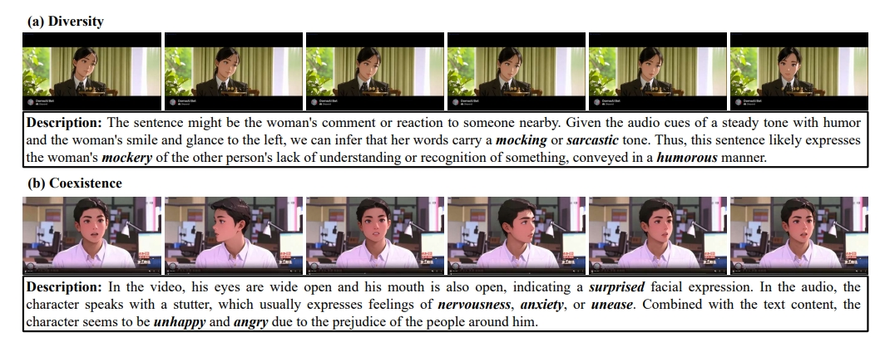
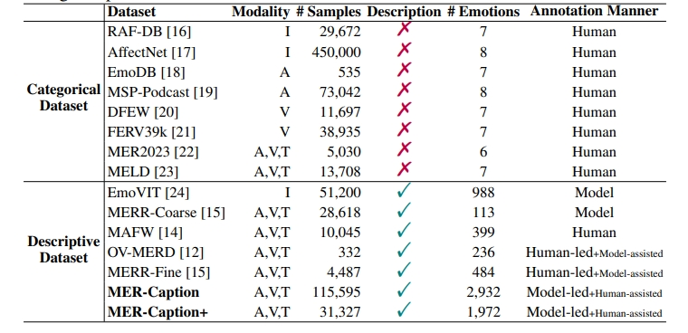
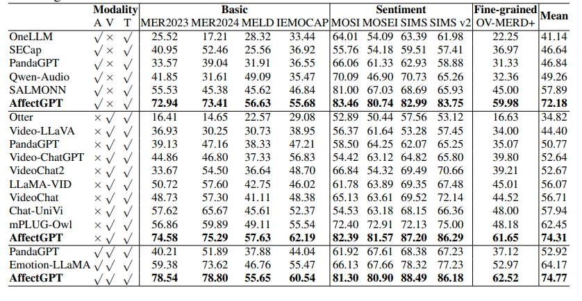

<p align="center">
    
<p>

<h3 align="center"><a href="https://arxiv.org/pdf/2501.16566" style="color:#9C276A">
AffectGPT: A New Dataset, Model, and Benchmark
for Emotion Understanding with Multimodal Large
Language Models</a></h3>
<h5 align="center"> If our project helps you, please give us a star ⭐ on GitHub to support us. 🙏🙏 </h2>

<h5 align="center">


[](LICENSE) 
[](https://arxiv.org/pdf/2501.16566) <br>

</h5>



## 🛠️ Requirements and Installation
My Dependencies (We have not tested other envs):
* python == 3.10
* pytorch == 2.4.0
* CUDA Version == 12.1
* transformers == 4.49.0
* tokenizers == 0.21.0
* vllm == 0.6.1

**[Environment Preparation]**
```bash
conda env create -f environment.yml
```

## 🚀 MER-Caption+

We construct a large-scale emotional description dataset MER-Caption, which adopts a model-led, human-assisted annotation strategy to strike a balance between label quality and dataset size.

<p></p>

This dataset is available at: https://huggingface.co/datasets/MERChallenge/MER2025
```bash
dataset
├── mer2025-dataset
|   ├── video # all training data, including 132,171 samples
|   ├── audio # pre-extracted audio
|   ├── openface_face # # pre-extracted face files
|   ├── subtitle_chieng.csv # pre-extracted subtitle content
|   ├── track2_train_mercaptionplus.csv # MER-Caption+ Dataset (OV labels)
|   ├── track3_train_mercaptionplus.csv # MER-Caption+ Dataset (Description)
```

## ✨ MER-UniBench
We build MER-UniBench, which encompasses typical MER tasks with tailored metrics. This benchmark can offer comprehensive evaluation results for MLLM-based emotion understanding.

```bash
## MER-UniBench includes 9 datasets
dataset 
# Available at: https://pan.baidu.com/s/1kbfs5pG_hAri0QwvQl-Ecg?pwd=b9vn
# Alternative link: https://1024terabox.com/s/1AE7uAU3Ib8aRBSyF1TMpow
├── mer2023-dataset-process
├── mer2024-dataset-process
├── sims-process
├── simsv2-process
├── cmumosi-process
├── cmumosei-process
├── iemocap-process
├── meld-process
# Available at: https://pan.baidu.com/s/1nBTw_ujSTQPAMyIs5Qv8Zw?pwd=k8tj
# Alternative link: https://1024terabox.com/s/1O130fc81FVsGGsrjLuHyDA
├── ovmerdplus-process
```


## :earth_americas: Model Zoo
### General Checkpoints
| Model Name     | Model Type |
|:----------------|:------------:|
| [clip-vit-large-patch14](https://huggingface.co/openai/clip-vit-large-patch14)  | Visual Encoder  |
| [chinese-hubert-large](https://huggingface.co/TencentGameMate/chinese-hubert-large)  | Audio Encoder |
| [Qwen2.5-7B-Instruct](https://huggingface.co/Qwen/Qwen2.5-7B-Instruct)  | LLM |


### Pretrained AffectGPT Checkpoints
| Model Name     | Model Type |
|:----------------|:------------:|
| [emercoarse_highlevelfilter4_outputhybird_bestsetup_bestfusion_lz](https://pan.baidu.com/s/1wtKBxHQP4eCUSAVuBrOzag?pwd=27sh)  | Training on **MERCaption+** and take pre-extracted **face** as input  |

Meanwhile, we provide an alternate download link on Hugging Face: https://huggingface.co/MERChallenge/AffectGPT

## 🗝️ Training & Inference

### Data and Pre-trained Checkpoints Structure
```bash
dataset
# MERCaption+ available at: https://huggingface.co/datasets/MERChallenge/MER2025
├── mer2025-dataset
|   ├── video # all training data, including 132,171 samples
|   ├── audio # pre-extracted audio
|   ├── openface_face # # pre-extracted face files
|   ├── subtitle_chieng.csv # pre-extracted subtitle content
|   ├── track2_train_mercaptionplus.csv # MER-Caption+ Dataset (OV labels)
|   ├── track3_train_mercaptionplus.csv # MER-Caption+ Dataset (Description)

# MER-UniBench 
# Available at: https://pan.baidu.com/s/1kbfs5pG_hAri0QwvQl-Ecg?pwd=b9vn
# Alternative link: https://1024terabox.com/s/1AE7uAU3Ib8aRBSyF1TMpow
├── mer2023-dataset-process
├── mer2024-dataset-process
├── sims-process
├── simsv2-process
├── cmumosi-process
├── cmumosei-process
├── iemocap-process
├── meld-process
# Available at: https://pan.baidu.com/s/1nBTw_ujSTQPAMyIs5Qv8Zw?pwd=k8tj
# Alternative link: https://1024terabox.com/s/1O130fc81FVsGGsrjLuHyDA
├── ovmerdplus-process

AffectGPT
├── models # Available at: https://pan.baidu.com/s/1IvC4H7Xt1AzMFocGMBBbHQ?pwd=hzf9
│   ├── chinese-hubert-large # audio encoders
│   ├── clip-vit-large-patch14 # video encoders
│   ├── Qwen2.5-7B-Instruct # LLM
```

### Training
```bash
CUDA_VISIBLE_DEVICES=0 python -u train.py 
--cfg-path=train_configs/emercoarse_highlevelfilter4_outputhybird_bestsetup_bestfusion_lz.yaml
```

### Inference Code for MER-UniBench
1. Pre-trained Checkpoints Structure

We also provide pre-trained weights if you do not want to do the above training.
```bash
AffectGPT
├── models # Available at: https://pan.baidu.com/s/1IvC4H7Xt1AzMFocGMBBbHQ?pwd=hzf9
│   ├── chinese-hubert-large # audio encoders
│   ├── clip-vit-large-patch14 # video encoders
│   ├── Qwen2.5-7B-Instruct # LLM
├── output # Available at: https://pan.baidu.com/s/1wtKBxHQP4eCUSAVuBrOzag?pwd=27sh
│   ├── emercoarse_highlevelfilter4_outputhybird_bestsetup_bestfusion_lz # Training on mercaptionplus + input face
```

2. Inference Process 
```bash
# Prompt1: Generate OV labels
CUDA_VISIBLE_DEVICES=0 python -u inference_hybird.py --zeroshot --dataset='inferenceData' 
--cfg-path=train_configs/emercoarse_highlevelfilter4_outputhybird_bestsetup_bestfusion_lz.yaml 
--options "inference.test_epochs=30-60" "inference.skip_epoch=5"

# Prompt2: Generate Emotion Description
CUDA_VISIBLE_DEVICES=0 python -u inference_hybird.py --zeroshot --dataset='inferenceData' 
--outside_user_message="Please infer the person's emotional state and provide your reasoning process."
--cfg-path=train_configs/emercoarse_highlevelfilter4_outputhybird_bestsetup_bestfusion_lz.yaml 
--options "inference.test_epochs=30-60" "inference.skip_epoch=5" "inference.base_root=output/results-description"
```


## 👍 Score Calculation

1. If you want to skip the above inference process, we also provide intermedia outputs for evaluation.
```bash
[1] prepare results
AffectGPT
├── models # Available at: https://pan.baidu.com/s/1IvC4H7Xt1AzMFocGMBBbHQ?pwd=hzf9
│   ├── chinese-hubert-large # audio encoders
│   ├── clip-vit-large-patch14 # video encoders
│   ├── Qwen2.5-7B-Instruct # LLM
├── output # Available at: https://pan.baidu.com/s/1pIoMM3RT7BqeyGI0t5KdoQ?pwd=c7x2
│   ├── emercoarse_highlevelfilter4_outputhybird_bestsetup_bestfusion_lz # Training on mercaptionplus + input face
│   ├── **results-cmumosei** # Intermedia Outputs
│   ├── **results-cmumosi** # Intermedia Outputs
│   ├── **results-iemocapfour** # Intermedia Outputs
│   ├── **results-meld** # Intermedia Outputs
│   ├── **results-mer2023** # Intermedia Outputs
│   ├── **results-mer2024** # Intermedia Outputs
│   ├── **results-sims** # Intermedia Outputs
│   ├── **results-simsv2** # Intermedia Outputs
│   ├── **results-ovmerdplus** # Intermedia Outputs

[2] score calculation: ov labels + gt labels => score
CUDA_VISIBLE_DEVICES=0 python evaluation-scoreonly.py
```

2. Full evaluation code
```bash
CUDA_VISIBLE_DEVICES=0 python evaluation.py
```

<p></p>


## 🤖 Inference for Single Video
1. Since *emercoarse_highlevelfilter4_outputhybird_bestsetup_bestfusion_lz* relies on pre-extracted faces. For convenience, we provide a more simple version that does not rely on pre-extracted face but can direct process on the raw frames.
```bash
AffectGPT
├── models # Available at: https://pan.baidu.com/s/1IvC4H7Xt1AzMFocGMBBbHQ?pwd=hzf9
│   ├── chinese-hubert-large # audio encoders
│   ├── clip-vit-large-patch14 # video encoders
│   ├── Qwen2.5-7B-Instruct # LLM
├── output # Available at: https://pan.baidu.com/s/1iO-KyekHH3t7hDOVHy4ypg?pwd=yex1
│   ├── mercaptionplus_outputhybird_bestsetup_bestfusion_frame_lz 
```

2. You can use any tool to extract audio and subtitle from video.
```bash
[1] generate ov labels
CUDA_VISIBLE_DEVICES=0 python -u inference_sample.py --zeroshot
--video_path='demo/sample_00000000.mp4' --audio_path='demo/sample_00000000.wav' --subtitle="I don't know! I, I, I don't have experience in this area."
--cfg-path=train_configs/mercaptionplus_outputhybird_bestsetup_bestfusion_frame_lz.yaml 
--options "inference.test_epoch=30"

[2] generate emotion description
CUDA_VISIBLE_DEVICES=0 python -u inference_sample.py --zeroshot 
--video_path='demo/sample_00000000.mp4' --audio_path='demo/sample_00000000.wav' --subtitle="I don't know! I, I, I don't have experience in this area."
--outside_user_message="Please infer the person's emotional state and provide your reasoning process."
--cfg-path=train_configs/mercaptionplus_outputhybird_bestsetup_bestfusion_frame_lz.yaml 
--options "inference.test_epoch=30"

# For the above code, the output description should begin with "In the text", otherwise your inference code or downloaded model may contain errors.
```

## 📑 Citation

If you find AffectGPT useful for your research and applications, please cite using this BibTeX:
```bibtex
# MER-Caption dataset, MER-Caption+ dataset, AffectGPT Framework
@article{lian2025affectgpt,
  title={AffectGPT: A New Dataset, Model, and Benchmark for Emotion Understanding with Multimodal Large Language Models},
  author={Lian, Zheng and Chen, Haoyu and Chen, Lan and Sun, Haiyang and Sun, Licai and Ren, Yong and Cheng, Zebang and Liu, Bin and Liu, Rui and Peng, Xiaojiang and others},
  journal={ICML (Oral, Top 1%)},
  year={2025}
}

# OV-MERD dataset
@article{lian2024open,
  title={Open-vocabulary Multimodal Emotion Recognition: Dataset, Metric, and Benchmark},
  author={Lian, Zheng and Sun, Haiyang and Sun, Licai and Chen, Lan and Chen, Haoyu and Gu, Hao and Wen, Zhuofan and Chen, Shun and Zhang, Siyuan and Yao, Hailiang and others},
  journal={ICML},
  year={2024}
}

# EMER task
@article{lian2023explainable,
  title={Explainable Multimodal Emotion Recognition},
  author={Lian, Zheng and Sun, Haiyang and Sun, Licai and Gu, Hao and Wen, Zhuofan and Zhang, Siyuan and Chen, Shun and Xu, Mingyu and Xu, Ke and Chen, Kang and others},
  journal={arXiv preprint arXiv:2306.15401},
  year={2023}
}

# MER2023 Dataset
@inproceedings{lian2023mer,
  title={Mer 2023: Multi-label learning, modality robustness, and semi-supervised learning},
  author={Lian, Zheng and Sun, Haiyang and Sun, Licai and Chen, Kang and Xu, Mngyu and Wang, Kexin and Xu, Ke and He, Yu and Li, Ying and Zhao, Jinming and others},
  booktitle={Proceedings of the 31st ACM international conference on multimedia},
  pages={9610--9614},
  year={2023}
}

# MER2024 Dataset
@inproceedings{lian2024mer,
  title={Mer 2024: Semi-supervised learning, noise robustness, and open-vocabulary multimodal emotion recognition},
  author={Lian, Zheng and Sun, Haiyang and Sun, Licai and Wen, Zhuofan and Zhang, Siyuan and Chen, Shun and Gu, Hao and Zhao, Jinming and Ma, Ziyang and Chen, Xie and others},
  booktitle={Proceedings of the 2nd International Workshop on Multimodal and Responsible Affective Computing},
  pages={41--48},
  year={2024}
}
```

## 👍 Acknowledgement
The codebase of AffectGPT is adapted from [**Video-LLaMA**](https://github.com/DAMO-NLP-SG/Video-LLaMA) and [**Video-LLaMA2**](https://github.com/DAMO-NLP-SG/VideoLLaMA2). We are also grateful for their excellent work.


## 🔒 License

This project is released under the Apache 2.0 license as found in the LICENSE file.
The service is a research preview intended for **non-commercial use ONLY**. Please get in touch with us if you find any potential violations.
